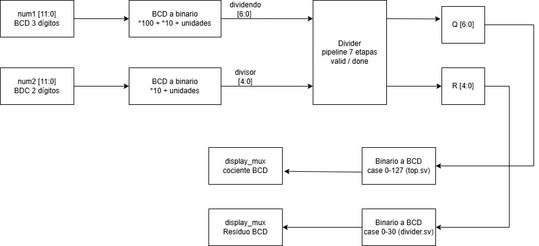
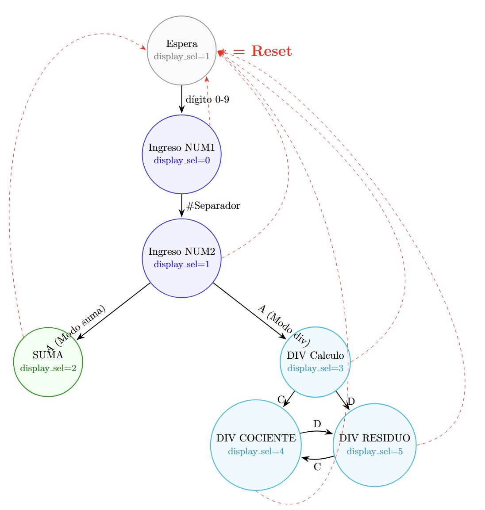
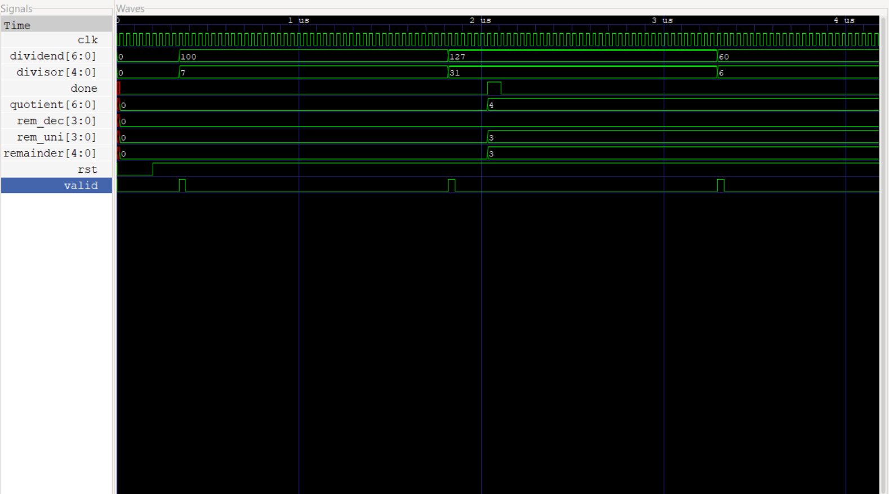
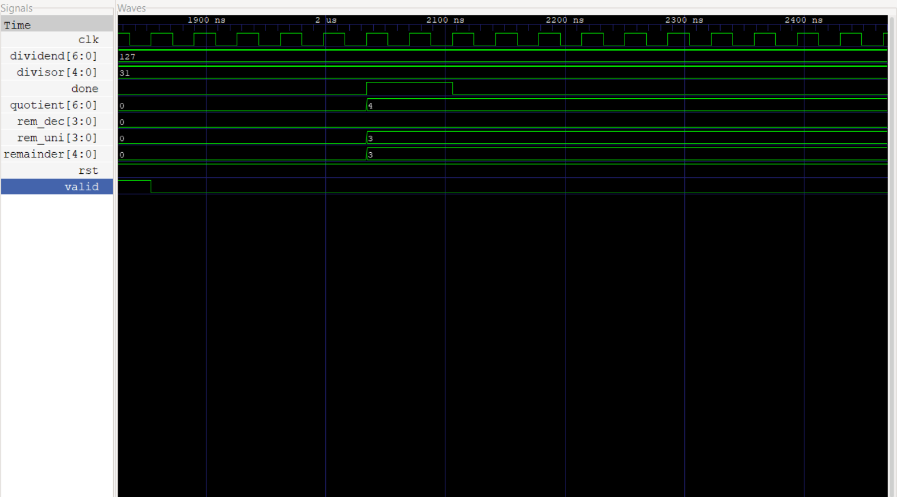

**Instituto Tecnológico de Costa Rica**

Escuela de Electrónica

**Proyecto 3**

Diseño Lógico

**Elaborado por**

Gloriana Carrillo Cabezas

Gabriel Chaves Esquivel

Jean Paúl Sequeira Salazar

# Introducción

El presente proyecto corresponde al Proyecto Corto III del curso EL-3307 Diseño Lógico, y consiste
en la extensión del sistema digital sincrónico desarrollado en el Proyecto Corto II, ahora con la
incorporación de una unidad de división entera de números sin signo. El sistema se despliega sobre
una FPGA TangNano 9K y funciona como una calculadora capaz de realizar tanto sumas como divisiones:
el usuario selecciona el modo de operación mediante una tecla dedicada, ingresa dos números decimales
mediante un teclado hexadecimal mecánico, y visualiza los resultados en cuatro displays de 7 segmentos.
En modo división, el sistema muestra el cociente y el residuo de forma independiente y seleccionable.

El diseño mantiene los principios fundamentales del diseño digital sincrónico del proyecto anterior:
un único reloj de 27 MHz, sincronización de señales asíncronas y eliminación de rebote mecánico.
La unidad de división se implementa mediante un algoritmo de división restoring con estructura de
pipeline de 7 etapas, lo que permite operar a la frecuencia de reloj objetivo sin violar las
restricciones de temporizado. El sistema soporta dividendos de hasta 7 bits (máximo 127) y divisores
de hasta 5 bits (máximo 31), correspondiente al puntaje extra del enunciado.

# Problema

Se requiere extender el sistema de calculadora desarrollado en el Proyecto Corto II para incorporar
una unidad de división entera de números sin signo. El sistema debe recibir entradas asincrónicas
mediante teclado mecánico, procesarlas de forma sincrónica a 27 MHz, calcular tanto la suma como
la división entera de dos números decimales, y visualizar el cociente y el residuo de la división
en hardware externo. El usuario debe poder seleccionar entre el modo suma y el modo división, así
como alternar entre la visualización del cociente y la del residuo.

# Objetivos

## General
Introducir al estudiante a la implementación de algoritmos por medio de máquinas de estados complejas,
mediante el diseño de una unidad de cálculo de división de enteros integrada a un sistema digital
sincrónico completo.

## Específicos
1. Elaborar una implementación de un diseño digital en una FPGA.
2. Construir un testbench básico para validar las especificaciones del diseño.
3. Implementar un algoritmo de división de enteros con pipeline de 7 etapas en SystemVerilog.
4. Extender la FSM de control para soportar los modos de suma y división, así como la selección
   entre cociente y residuo.
5. Implementar la conversión entre representación BCD y binario para los operandos y resultados
   de la división.
6. Coordinación de trabajo en equipo mediante el uso de herramientas de control de versiones.
7. Practicar planificación de tareas para trabajo de grupo.

# Especificaciones

* Frecuencia de Reloj: 27 MHz.
* Entrada: Teclado hexadecimal 4x4.
* Salida: 4 displays de 7 segmentos.
* Modo suma: Dos números positivos de hasta 3 dígitos cada uno (0–999).
* Modo división: Dividendo de hasta 3 dígitos (0–127) y divisor de hasta 2 dígitos (1–31).
* Resultado división: Cociente (0–127) y residuo (0–30), seleccionables por teclado.

# Funcionamiento general del circuito

El sistema implementado es una calculadora de dos modos de operación —suma y división entera—
que opera completamente de forma sincrónica con un reloj único de 27 MHz proveniente de la
TangNano 9K. El usuario selecciona el modo activo presionando la tecla B, que alterna entre
suma y división. En ambos modos, el flujo de ingreso es el mismo: se digitan dos números
decimales mediante el teclado hexadecimal, separados por la tecla #, y se confirma la operación
con la tecla A. La tecla * reinicia el sistema desde cualquier estado.

En modo suma, el resultado de la adición se muestra directamente en los cuatro displays al
confirmar el segundo número. En modo división, el sistema lanza la unidad de división con
pipeline y, una vez que la señal done se activa (tras 7 ciclos de reloj de latencia), el
resultado queda disponible. El usuario puede entonces alternar entre ver el cociente (tecla C)
y el residuo (tecla D) en los displays.

El display más significativo (dígito 3) actúa como indicador de modo: muestra la letra "S"
cuando el sistema está en modo suma y la letra "d" cuando está en modo división, permitiendo
al usuario identificar visualmente el modo activo en todo momento.

El circuito se divide en cuatro subsistemas principales interconectados: lectura del teclado,
cálculo aritmético (suma y división), conversión BCD↔binario, y despliegue en 7 segmentos.

# Diagrama de bloques de subsistemas


## Lectura del teclado

Este subsistema se encarga de capturar de forma confiable las pulsaciones del teclado mecánico y traducirlas en dígitos decimales válidos para el resto del sistema. Está compuesto por seis módulos internos:

__Divisor de frecuencia:__ Genera un pulso de un ciclo de duración denominado tick_out, contando N ciclos del reloj de 27 MHz. Este pulso es la base de tiempo que utilizan los demás módulos para saber cuándo actualizar su estado.

__Sincronizador de señales:__ Las señales provenientes del teclado son asíncronas respecto al reloj de la FPGA, lo que puede causar metaestabilidad en los flip-flops. Para resolverlo, se encadenan dos flip-flops tipo D que retardan la señal dos ciclos de reloj, asegurando una señal limpia y estable a la salida.

__Debounce (eliminación de rebote):__ Implementa una FSM de cuatro estados (Inactivo, Contando, Activo, Rebotando) que requiere que la señal se mantenga estable durante un tiempo equivalente a DEBOUNCE_TICKS pulsos del tick antes de considerarla válida. Si la señal baja antes de ese tiempo, se trata como un rebote mecánico y se ignora.

__Scanner del teclado (contador de anillo):__ Activa cíclicamente una columna del teclado a la vez mediante el patrón 0001 → 0010 → 0100 → 1000 → 0001 → .... Cuando una fila detecta un 1, se conoce exactamente qué columna estaba activa en ese instante, identificando así la tecla presionada por su par fila-columna.

__Decodificador fila-columna:__ Recibe la fila y la columna activa y devuelve el valor numérico de la tecla presionada. Las teclas especiales tienen funciones asignadas: # confirma el primer número, A confirma el segundo número, y * limpia el sistema (reset).

__FSM de control de ingreso:__ Es el módulo central del subsistema. Acumula los dígitos ingresados desplazando el registro BCD hacia la izquierda con cada nuevo dígito, de manera análoga a una calculadora tradicional. Los números se almacenan en codificación BCD (Binary Coded Decimal) con 10 bits cada uno (3 dígitos × 4 bits, con 2 bits extra como aproximación). 


## Suma Aritmetica

Este subsistema recibe los dos números almacenados en BCD y calcula su suma. Los datos de entrada pasan primero por registros sincronizados al reloj (Reg. num1 y Reg. num2, de 10 bits BCD cada uno) antes de entrar al sumador, garantizando el comportamiento sincrónico. El sumador opera directamente en BCD, soportando hasta 4 dígitos en el resultado (máximo 999 + 999 = 1998). El resultado queda almacenado en un registro de salida también sincronizado al reloj, desde donde lo recibe el subsistema de despliegue.


## Subsistema de división entera

Este subsistema recibe el dividendo y el divisor ya convertidos a binario desde el módulo superior,
y calcula el cociente y el residuo mediante el algoritmo de división restoring. La implementación
utiliza una arquitectura de pipeline de 7 etapas, una por cada bit del dividendo, lo que permite
recibir una nueva operación cada ciclo de reloj una vez que el pipeline está lleno, con una latencia
fija de 7 ciclos desde que se activa la señal valid hasta que done se pone en alto.

### Algoritmo de división restoring

El algoritmo opera procesando el dividendo bit a bit, del más significativo al menos significativo.
En cada etapa se desplaza el residuo parcial un lugar a la izquierda y se concatena el siguiente
bit del dividendo. Luego se intenta restar el divisor de ese residuo parcial:

* Si el resultado de la resta es negativo (bit de signo en alto), el bit de cociente correspondiente
  es 0 y el residuo parcial se restaura al valor anterior a la resta.
* Si el resultado es positivo o cero, el bit de cociente es 1 y el residuo parcial se actualiza
  con el resultado de la resta.

Al completar las 7 etapas, los 7 bits de cociente generados se concatenan para formar el resultado
final, y el residuo parcial de la última etapa es el residuo definitivo de la operación.

### Estructura pipeline

Cada etapa del pipeline está separada de la siguiente por registros sincronizados al flanco positivo
del reloj. Esto corta el camino crítico combinacional que existiría si el divisor fuera puramente
combinacional, permitiendo operar a 27 MHz sin violaciones de temporizado.

Cada etapa propaga hacia la siguiente los siguientes datos:

* El residuo parcial calculado en esa etapa (6 bits).
* El divisor original (5 bits), que se propaga sin modificación a lo largo de todas las etapas.
* Los bits restantes del dividendo aún no procesados.
* Los bits de cociente ya calculados en etapas anteriores.
* La señal valid, que se propaga etapa por etapa para indicar que los datos son válidos.

### Entradas y salidas

| Puerto | Bits | Dirección | Descripción |
|---|---|---|---|
| clk | 1 | entrada | Reloj del sistema (27 MHz) |
| rst | 1 | entrada | Reset síncrono activo en bajo |
| dividend | 7 | entrada | Dividendo en binario (máximo 127) |
| divisor | 5 | entrada | Divisor en binario (máximo 31) |
| valid | 1 | entrada | Indica que los operandos son válidos |
| quotient | 7 | salida | Cociente de la división |
| remainder | 5 | salida | Residuo de la división |
| rem_dec | 4 | salida | Dígito de decenas del residuo en BCD |
| rem_uni | 4 | salida | Dígito de unidades del residuo en BCD |
| done | 1 | salida | Indica que el resultado es válido |

### Conversión BCD del residuo

Dado que el residuo máximo posible es 30 (divisor máximo 31 menos 1), el módulo incluye
internamente una tabla case completa que convierte el residuo binario directamente a sus
dígitos BCD de decenas y unidades, evitando operaciones aritméticas de división o módulo
que podrían generar problemas de síntesis en la herramienta Gowin.



## Conversión BCD a binario y binario a BCD

Este subsistema realiza las conversiones necesarias entre la representación BCD en que se almacenan
los números ingresados por teclado y la representación binaria que requiere el módulo divisor, así
como la conversión inversa para mostrar los resultados en los displays.

### BCD a binario (entrada al divisor)

Los números ingresados por teclado se almacenan en formato BCD con 12 bits (3 dígitos × 4 bits).
Antes de enviarse al módulo divisor, se convierten a binario mediante la siguiente expresión
combinacional implementada en el módulo top:

* **Dividendo** (máximo 127, 7 bits):
  `dividend_bin = (num1[11:8] × 100) + (num1[7:4] × 10) + num1[3:0]`

* **Divisor** (máximo 31, 5 bits):
  `divisor_bin = (num2[7:4] × 10) + num2[3:0]`

Estas expresiones son puramente combinacionales y se evalúan continuamente. La señal valid
que activa el divisor solo se afirma cuando la FSM ha confirmado que ambos operandos son
válidos, por lo que no hay riesgo de que el divisor opere con datos intermedios.

### Binario a BCD (salida del divisor)

Los resultados de la división se entregan en binario y deben convertirse a BCD para su
visualización en los displays.

* **Residuo:** La conversión se realiza dentro del propio módulo divisor mediante una tabla
  case completa que cubre todos los valores posibles de 0 a 30. Esta decisión de diseño evita
  operaciones aritméticas de división o módulo que generaban problemas de síntesis en la
  herramienta Gowin.

* **Cociente:** La conversión se realiza en el módulo top mediante una tabla case completa
  que cubre todos los valores posibles de 0 a 127, entregando tres dígitos BCD independientes
  (centenas, decenas y unidades) para su conexión directa al multiplexor de displays.

## Despliegue en 7 segmentos

Este subsistema toma los números num1, num2 y el resultado de la suma, y los muestra de forma decimal en cuatro displays físicos de 7 segmentos con cátodo común. Está formado por cuatro módulos:

__Divisor de frecuencia:__ Reduce el reloj de 27 MHz a aproximadamente 1 kHz, que es la frecuencia de refresco de los displays. A esta velocidad el ojo humano percibe todos los dígitos encendidos simultáneamente aunque solo uno esté activo a la vez.

__Contador de dígito y multiplexor 4:1:__ Un contador sincrónico del 0 al 3 selecciona cíclicamente cuál de los cuatro displays está activo. El multiplexor escoge el dígito BCD correspondiente (unidades, decenas, centenas o millares) para enviarlo al codificador.

__Control de ánodos:__ Activa únicamente el ánodo del display seleccionado. Los ánodos son activos en bajo, por lo que un 0 enciende el display y un 1 lo apaga. Solo un display está encendido en cada instante.

| Display activo | Ánodo [3:0] | Dígito mostrado |
|----------------|-------------|-----------------|
| Display "0" | 1110 | Unidades |
| Display "1" | 1101 | Decenas |
| Display "2" | 1011 | Centenas |
| Display "3" | 0111 | Millares |

__Codificador BCD a 7 segmentos:__ Es un bloque puramente combinacional (sin reloj) que implementa una tabla de verdad directa: cada valor del 0 al 9 genera el patrón fijo de 7 bits que activa los segmentos correctos del display para representar ese dígito en decimal.

La conexión física de los displays utiliza transistores NPN como interruptores de corriente, dado que la FPGA no puede suministrar directamente la corriente necesaria para encender los LEDs. Resistencias de 220 Ω limitan la corriente por segmento (~5.9 mA) y resistencias de 1 kΩ protegen la base de los transistores (~3.3 mA), evitando sobrecargar los pines de la TangNano.


# Diagramas de estado

## FSM principal

Esta FSM es el cerebro del subsistema de lectura del teclado. Controla el flujo completo de la
interacción con el usuario, desde la espera inicial hasta la ejecución de la operación seleccionada.
A diferencia del proyecto anterior, ahora cuenta con siete estados para soportar tanto el modo suma
como el modo división con visualización independiente de cociente y residuo.

El modo de operación (suma o división) se controla mediante un registro independiente que se alterna
con la tecla B desde cualquier estado. Este registro no forma parte de la FSM de estados sino que
actúa como una señal de control global que determina hacia qué estado se transiciona al presionar
la tecla A en INGRESO_NUM2.

| Estado | display_sel | Descripción |
|---|---|---|
| ESPERA | 0 | Estado inicial y de reset. El display muestra el indicador de modo. El sistema aguarda cualquier pulsación numérica para comenzar. |
| INGRESO_NUM1 | 0 | El sistema acumula los dígitos del primer número desplazando el registro BCD hacia la izquierda con cada nueva tecla numérica (0–9). Los dígitos se muestran en tiempo real. |
| INGRESO_NUM2 | 1 | Idéntico al estado anterior pero para el segundo número. El display muestra los dígitos de NUM2 a medida que se ingresan. |
| SUMA | 2 | Se ejecuta la suma aritmética y se despliega el resultado en los displays. El sistema permanece aquí hasta que el usuario presione *. |
| DIV_CALCULO | 3 | Se activa la señal valid hacia el módulo divisor y se aguarda el resultado. Los displays muestran ceros mientras se calcula. |
| DIV_COCIENTE | 4 | Se muestra el cociente de la división en los displays. El usuario puede alternar a DIV_RESIDUO con la tecla D. |
| DIV_RESIDUO | 5 | Se muestra el residuo de la división en los displays. El usuario puede alternar a DIV_COCIENTE con la tecla C. |

Las transiciones entre estados se producen exclusivamente por teclas especiales:

* Cualquier tecla numérica (0–9) en ESPERA → transición a INGRESO_NUM1
* Tecla # en INGRESO_NUM1 → transición a INGRESO_NUM2
* Tecla A en INGRESO_NUM2 (modo suma) → transición a SUMA
* Tecla A en INGRESO_NUM2 (modo división) → transición a DIV_CALCULO
* Tecla C en DIV_CALCULO o DIV_RESIDUO → transición a DIV_COCIENTE
* Tecla D en DIV_CALCULO o DIV_COCIENTE → transición a DIV_RESIDUO
* Tecla B (desde cualquier estado) → alterna el modo suma/división sin cambiar de estado
* Tecla * (desde cualquier estado) → reset, regreso a ESPERA

 //##############

## Debounce

Esta FSM se encarga de filtrar el ruido mecánico inherente a cualquier tecla física. Cuando se presiona un botón mecánico, la señal no sube limpiamente de 0 a 1, sino que oscila brevemente antes de estabilizarse. La FSM detecta y descarta estas oscilaciones. Cuenta con cuatro estados:

| Estado | Descripcion |
|--------|-------------|
| Inactivo | Estado de reposo. No hay tecla presionada (tecla = 0). El sistema espera que la señal suba. |
| Contando | La señal subió, lo que podría ser el inicio de una pulsación real o un rebote. Se inicia un contador que espera DEBOUNCE_TICKS pulsos del tick para verificar la estabilidad. |
| Activo | La señal se mantuvo estable durante el tiempo requerido: la tecla se considera válida (tecla_valida = 1). El sistema espera ahora a que la señal baje. |
| Rebotando | La señal bajó después de haber sido validada. Se espera un nuevo periodo de estabilidad de 20 ms antes de regresar a Inactivo, evitando detectar el rebote de salida como una nueva pulsación. |
|

Las transiciones entre estados se producen de la siguiente manera:

* Inactivo → Contando: la señal sube (posible pulsación detectada)
* Contando → Inactivo: la señal baja antes de completar el tiempo (era un rebote, se ignora)
* Contando → Activo: el tiempo de estabilidad se cumple (pulsación válida confirmada)
* Activo → Rebotando: la señal baja (el usuario soltó la tecla)
* Rebotando → Inactivo: el tiempo de espera de salida se cumple (sistema listo para nueva tecla)


# Ejemplo y análisis de una simulación funcional del sistema completo

## Simulación del módulo divisor

### Descripción del caso de prueba

Se ejecutó una simulación del módulo divisor con pipeline de 7 etapas utilizando un testbench
dedicado. La simulación verifica el comportamiento del protocolo valid/done y la correctitud
de los resultados para tres casos de prueba:

| Caso | Dividendo | Divisor | Cociente esperado | Residuo esperado |
|------|-----------|---------|-------------------|------------------|
| 1    | 100       | 7       | 14                | 2                |
| 2    | 127       | 31      | 4                 | 3                |
| 3    | 60        | 6       | 10                | 0                |

### Ejecución de la simulación

```bash
cd Proyecto-3-Diseno-Logico\open_source_fpga_environment\CALCULADORA\Receptor\src\build
make test_div
make wv_div
```

### Formas de onda obtenidas

Las siguientes gráficas muestran el comportamiento temporal del módulo divisor:




### Análisis de los resultados

#### Protocolo valid/done
La señal `valid` se afirma durante exactamente un ciclo de reloj para indicar que los operandos
son válidos. Tras una latencia fija de 7 ciclos de reloj —correspondientes a las 7 etapas del
pipeline— la señal `done` se activa durante un ciclo, indicando que el resultado es estable
y puede ser leído por el subsistema de despliegue.

#### Caso verificado: 127 ÷ 31
El caso más representativo corresponde al límite superior del puntaje extra. La simulación
confirma que para `dividend=127` y `divisor=31`, el módulo produce `quotient=4` y `remainder=3`,
lo cual es correcto ya que 31×4 + 3 = 127. La conversión BCD del residuo también es correcta:
`rem_dec=0`, `rem_uni=3`.

#### Latencia del pipeline
Se observa claramente en las formas de onda que el resultado aparece exactamente 7 ciclos
de reloj después del pulso de `valid`, confirmando el comportamiento de pipeline de latencia
fija diseñado. A 27 MHz esto equivale a aproximadamente 259 ns de latencia total.

### Conclusión de la simulación

El módulo divisor demuestra funcionar correctamente para el caso límite del puntaje extra
(127÷31). El protocolo valid/done opera según lo diseñado y la latencia de 7 ciclos es
consistente con la arquitectura de pipeline implementada. La funcionalidad completa del
sistema integrado fue además verificada en hardware físico sobre la FPGA TangNano 9K.

# Análisis de consumo de recursos en la FPGA y el consumo de potencia

El flujo de herramientas de código abierto empleado —Yosys para síntesis lógica y nextpnr para
ruteo— trabaja exclusivamente a nivel RTL y mapeo de celdas. Esto implica una limitación concreta:
el flujo carece de modelos eléctricos del dispositivo físico, por lo que calcular el consumo de
potencia de la misma manera que lo haría el software propietario de Gowin no es viable en este
entorno. Parámetros como las capacitancias internas de las LUT, las corrientes de fuga del silicio
o los modelos de conmutación de los flip-flops físicos sencillamente no están disponibles aquí.

Ante esta restricción, el análisis se apoya en los datos que entrega el reporte de síntesis y
de place-and-route. Los resultados obtenidos para el diseño completo del Proyecto 3 son los
siguientes:

| Recurso | Usado | Disponible | Utilización |
|---|---|---|---|
| SLICE | 1159 | 8640 | 13% |
| LUT1 | 390 | — | — |
| LUT2 | 79 | — | — |
| LUT3 | 86 | — | — |
| LUT4 | 212 | — | — |
| MUX2_LUT5 | 115 | 4320 | 2% |
| MUX2_LUT6 | 40 | 2160 | 1% |
| ALU | 176 | — | — |
| DFF/DFFR/DFFRE | 318 | — | — |
| IOB | 21 | 274 | 7% |

En total el diseño emplea 767 LUT entre básicas y extendidas por multiplexación, 318
flip-flops y 176 bloques aritméticos. Comparado con el Proyecto 2, el incremento más
significativo se observa en los flip-flops (de 178 a 318, un aumento del 79%) y en los
bloques ALU (de 108 a 176, un aumento del 63%), lo que refleja directamente el costo
del pipeline de 7 etapas del módulo divisor: cada etapa requiere registros para propagar
el residuo parcial, el divisor, los bits de cociente acumulados y la señal valid.

La utilización global de SLICEs es del 13%, lo que indica que el diseño aprovecha una
fracción moderada del dispositivo GW1NR-LV9QN88PC6 y deja margen suficiente para
extensiones futuras.

Un diseño con esta densidad de lógica secuencial —operando a 27 MHz y con múltiples
subsistemas activos como el pipeline divisor, la FSM de control, el decodificador de
teclado y el controlador de refresco de displays— genera una actividad de conmutación
notablemente mayor que la de proyectos combinacionales más simples.

La potencia dinámica en circuitos digitales se rige por la expresión P_din ≈ αCV²f,
donde el factor de actividad α y la capacitancia efectiva conmutada C dependen
directamente de cuántos nodos cambian de estado por ciclo de reloj. El pipeline de
división, al propagar datos a través de 7 etapas de registros en cada operación, contribuye
de forma significativa al factor α del diseño. Sin acceso a herramientas de estimación
eléctrica, no es posible dar una cifra exacta de consumo, pero sí puede afirmarse con
base técnica que el consumo dinámico es mayor que en el Proyecto 2, escalando
principalmente con la cantidad de flip-flops activos por ciclo y la frecuencia de operación.

# Reporte de velocidades máximas de reloj posibles en el diseño

El diseño fue desarrollado y probado funcionalmente usando un reloj de referencia de 27 MHz
(frecuencia disponible en la placa TangNano 9K). El reporte de place-and-route generado por
nextpnr indica que la herramienta trabajó con una frecuencia objetivo de 12 MHz, lo que
representa una restricción conservadora del flujo abierto utilizado. Sin embargo, el diseño
opera correctamente a 27 MHz en hardware físico, lo que confirma que el margen de temporizado
real es suficiente para la frecuencia de operación del sistema.

## Caminos críticos del diseño

Con la incorporación del módulo divisor pipeline, los caminos críticos del diseño cambiaron
respecto al Proyecto 2. Los más relevantes son:

**Pipeline del divisor:** Cada etapa del pipeline realiza una resta de 6 bits seguida de un
multiplexor que selecciona entre el residuo anterior y el resultado de la resta. Esta cadena
combinacional —resta + mux— es el camino crítico más probable dentro del módulo divisor.
La ventaja del pipeline es precisamente que este camino está acotado a una sola etapa, no
a las 7 en serie, lo que permite operar a frecuencias mayores que un divisor combinacional puro.

**Conversión binario a BCD del cociente:** La tabla case de 128 entradas implementada en el
módulo top es puramente combinacional. Dependiendo de cómo el sintetizador la mapea a LUTs,
puede generar una cadena de multiplexores que limite la frecuencia máxima.

**Sumador BCD:** La cadena de acarreo entre los tres dígitos BCD sigue siendo un camino
crítico del subsistema de suma, aunque es menos profundo que en implementaciones sin
corrección por dígito.

**Lógica combinacional de la FSM:** La lógica de siguiente estado que evalúa 7 estados y
múltiples condiciones de transición genera rutas combinacionales de profundidad moderada.

## Análisis de frecuencia máxima

| Camino crítico | Profundidad estimada | Impacto en f_max |
|---|---|---|
| Resta + mux del pipeline divisor | 1 etapa pipeline | Bajo (acotado por diseño) |
| Tabla case BCD cociente (128 entradas) | Media | Medio |
| Cadena de acarreo sumador BCD | 3 dígitos | Medio |
| Lógica de siguiente estado FSM | Baja | Bajo |

La arquitectura pipeline del divisor fue precisamente la decisión de diseño que permite
operar a 27 MHz: un divisor combinacional de 7 bits requeriría propagar el acarreo a través
de 7 etapas en serie en un solo ciclo de reloj, lo que sería inviable a esta frecuencia.
Al segmentar en 7 etapas con registros intermedios, el camino combinacional máximo se
reduce a una sola etapa de resta y multiplexor.

Para determinar la f_max real del diseño sería necesario ejecutar un análisis de timing
estático completo con modelos de celda del dispositivo físico, lo cual no está disponible
en el flujo abierto utilizado. No obstante, el funcionamiento verificado a 27 MHz en
hardware confirma que el diseño cumple con la restricción de frecuencia del enunciado.


# Principales problemas hallados durante el trabajo y soluciones aplicadas

Durante el desarrollo del proyecto se encontraron varios problemas tanto en el hardware físico como en la programación del sistema. A continuación se describen los más relevantes y las soluciones que se aplicaron.

__Resultados incorrectos en divisiones donde el divisor es mayor que el dividendo__

Durante las pruebas iniciales del módulo divisor, operaciones como 5 ÷ 9 producían
cocientes o residuos incorrectos. El problema radicaba en que el algoritmo restoring
no manejaba correctamente los casos donde el dividendo es menor que el divisor, ya que
el residuo parcial inicial nunca alcanza al divisor en ninguna etapa y el pipeline
propagaba valores intermedios incorrectos. La solución fue verificar el manejo del
bit de signo en cada etapa del pipeline, asegurando que cuando la resta produce un
resultado negativo, el residuo parcial se restaura correctamente al valor anterior
y el bit de cociente correspondiente se fija en 0.

__Falta de indicador visual del modo de operación__

Al integrar el modo suma y el modo división en un mismo sistema, surgió el problema
de que el usuario no tenía forma de saber en qué modo estaba operando la calculadora.
Esto generaba confusión al presionar la tecla A, ya que el sistema ejecutaba una
operación diferente a la esperada sin ningún aviso visual. La solución fue utilizar
el cuarto display (el más significativo) como indicador permanente de modo: muestra
la letra "S" cuando el sistema está en modo suma y la letra "d" cuando está en modo
división, aprovechando los patrones ya definidos en el módulo bcd_to_7seg.

__Error en la detección de la primera fila del teclado__

Durante las pruebas de integración se detectó que las teclas de la primera fila del
teclado (1, 2, 3, A) no eran detectadas correctamente por el sistema. El problema
se localizó en el módulo de decodificación, donde una asignación incorrecta de los
patrones fila-columna causaba que los eventos de la fila 0 no generaran un key_valid
válido. La corrección consistió en revisar y ajustar la tabla de decodificación en
el módulo keypad_decoder hasta que todos los patrones fila-columna correspondieran
correctamente a sus valores decimales.

__Identificación incorrecta de filas y columnas del teclado__

Al conectar inicialmente el teclado hexadecimal, el decodificador fila-columna producía valores incorrectos para varias teclas. El problema era que los pines físicos del conector del teclado no correspondían al orden esperado. Para resolverlo, se leyó y estudió detenidamente el datasheet del teclado específico utilizado, lo que permitió identificar correctamente cuáles pines correspondían a filas y cuáles a columnas, y reconfigurar las conexiones en la protoboard.

__Verificación del comportamiento eléctrico de filas y columnas__

Como parte del diagnóstico del problema anterior, se utilizó un multímetro para verificar que las filas pasaban de 0 V a aproximadamente 3.3 V al presionar la tecla respectiva, confirmando así el funcionamiento correcto de las resistencias pull-down. Para las columnas, se conectaron LEDs de prueba directamente para observar visualmente si el scanner las estaba activando en el orden correcto.

__Errores en el circuito de los transistores NPN__

Los transistores NPN encargados de controlar los ánodos de los displays no conducían correctamente en algunos casos. Para diagnosticar el problema, se conectó un LED directamente en la base de cada transistor para verificar si la señal de control de la FPGA llegaba correctamente. Esto permitió identificar conexiones incorrectas en la protoboard y corregirlas.

__Problema principal: errores en el código HDL__

El problema más significativo del proyecto fue la programación en SystemVerilog. Para resolverlo se recurrió a múltiples estrategias: se revisaron los videos tutoriales recomendados por el profesor, se consultaron distintos repositorios de código abierto para entender la lógica y los procedimientos utilizados en diseños similares, y se utilizó inteligencia artificial de manera responsable, enfocándose en localizar posibles errores en el código y comprender sus soluciones, sin sustituir el proceso de diseño propio del equipo.

__Ajuste del parámetro de debounce para simulación__

El contador de debounce está diseñado para esperar aproximadamente 20 ms antes de validar una tecla, lo que equivale a unos 540,000 ciclos de reloj a 27 MHz. Este tiempo hace inviable simular el sistema completo en un tiempo razonable. La solución fue parametrizar el módulo de debounce de manera que, en el testbench, se utilice una frecuencia simulada más alta, reduciendo el contador a solo 16 ciclos en vez de miles, sin modificar el comportamiento funcional del diseño real.
