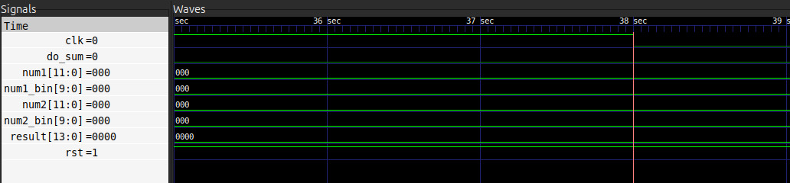
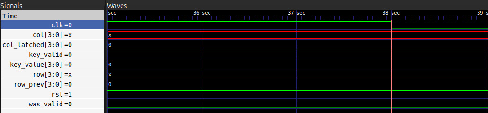
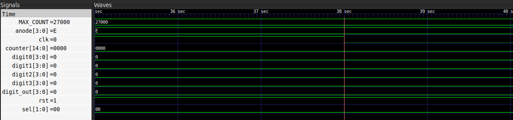
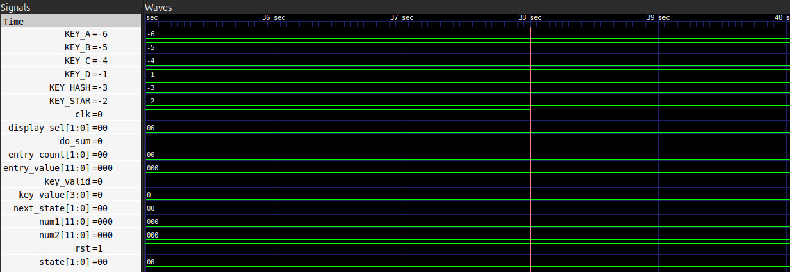
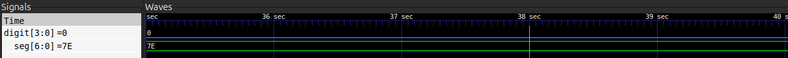
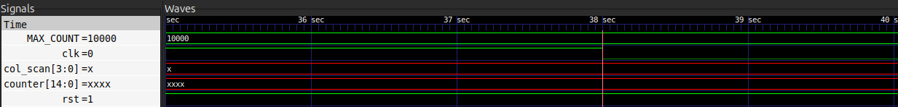

**Instituto Tecnológico de Costa Rica** 

Escuela de Electrónica  

**Proyecto 2**

Diseño lógico

**Elaborado por**
  
Gloriana Carrillo Cabezas 

Gabriel Chaves Esquivel

Jean Paúl Sequeira Salazar  

# Introduccion

El presente proyecto corresponde al Proyecto Corto II del curso EL-3307 Diseño Lógico, y consiste en el diseño e implementación de un sistema digital sincrónico completo utilizando SystemVerilog como lenguaje de descripción de hardware (HDL), desplegado sobre una FPGA TangNano 9K. El sistema funciona como una calculadora de suma: permite al usuario ingresar dos números decimales de hasta tres dígitos mediante un teclado hexadecimal mecánico, y muestra tanto los números ingresados como el resultado de su suma en cuatro displays de 7 segmentos. Todo el diseño sigue los principios fundamentales del diseño digital sincrónico, operando con un único reloj de 27 MHz, e incorpora técnicas de sincronización de señales asíncronas y eliminación de rebote mecánico. El desarrollo del proyecto abarcó desde el diseño de cada módulo y su verificación mediante simulaciones RTL, hasta la implementación física en protoboard y la programación de la FPGA.

# Problema

Se requiere diseñar un dispositivo capaz de funcionar como una calculadora básica que reciba entradas asincrónicas (teclado mecánico), las procese de forma sincrónica a 27 MHz y visualice la información en hardware externo.  


# Objetivos

## General
Introducir al estudiante al desarrollo de un sistema digital sincrónico utilizando lenguajes de descripción
de hardware.

## Especificos
1. Medir mediante un analizador lógico la salida de un dispositivo secuencial sencillo.
2. Evaluar la funcionalidad de un contador sincrónico integrado.
3. Diseñar un cerrojo o latch Set-Reset a partir de lógica combinacional integrada.
4. Evaluar los tiempos de funcionalidad de un flip-flop D integrado.
5. Elaborar una implementación de un diseño digital sincrónico en una FPGA.
6. Construir un testbench básico para validar las especificaciones del diseño.
7. Comprender los conceptos de sincronización de datos asincrónicos.
8. Implementar un algoritmo de captura de datos de un teclado hexadecimal.
9. Implementar una sencilla función de suma aritmética en un HDL.
10. Implementar un algoritmo de despliegue de datos en cuatro dispositivos de 7 segmentos.
11. Coordinación de trabajo en equipo mediante el uso de herramientas de control de versiones.
12. Practicar planificación de tareas para trabajo de grupo.

# Especificaciones

* Frecuencia de Reloj: 27 MHz.
* Entrada: Teclado hexadecimal 4x4.
* Salida: 4 displays de 7 segmentos
* Capacidad: Dos números positivos de hasta 3 dígitos cada uno (0-999).

# Funcionamiento general del circuito

El sistema implementado es una calculadora de suma de dos números decimales de hasta tres dígitos, operando completamente de forma sincrónica con un reloj único de 27 MHz proveniente de la TangNano 9K. El usuario ingresa los números mediante un teclado hexadecimal mecánico, los visualiza en tiempo real en cuatro displays de 7 segmentos mientras los digita, y obtiene el resultado de la suma al confirmar ambas entradas. El circuito se divide en tres subsistemas principales interconectados.

# Diagrama de bloques de subsistemas


## Lectura del teclado

Este subsistema se encarga de capturar de forma confiable las pulsaciones del teclado mecánico y traducirlas en dígitos decimales válidos para el resto del sistema. Está compuesto por seis módulos internos:

__Divisor de frecuencia:__ Genera un pulso de un ciclo de duración denominado tick_out, contando N ciclos del reloj de 27 MHz. Este pulso es la base de tiempo que utilizan los demás módulos para saber cuándo actualizar su estado.

__Sincronizador de señales:__ Las señales provenientes del teclado son asíncronas respecto al reloj de la FPGA, lo que puede causar metaestabilidad en los flip-flops. Para resolverlo, se encadenan dos flip-flops tipo D que retardan la señal dos ciclos de reloj, asegurando una señal limpia y estable a la salida.

__Debounce (eliminación de rebote):__ Implementa una FSM de cuatro estados (Inactivo, Contando, Activo, Rebotando) que requiere que la señal se mantenga estable durante un tiempo equivalente a DEBOUNCE_TICKS pulsos del tick antes de considerarla válida. Si la señal baja antes de ese tiempo, se trata como un rebote mecánico y se ignora.

__Scanner del teclado (contador de anillo):__ Activa cíclicamente una columna del teclado a la vez mediante el patrón 0001 → 0010 → 0100 → 1000 → 0001 → .... Cuando una fila detecta un 1, se conoce exactamente qué columna estaba activa en ese instante, identificando así la tecla presionada por su par fila-columna.

__Decodificador fila-columna:__ Recibe la fila y la columna activa y devuelve el valor numérico de la tecla presionada. Las teclas especiales tienen funciones asignadas: # confirma el primer número, A confirma el segundo número, y * limpia el sistema (reset).

__FSM de control de ingreso:__ Es el módulo central del subsistema. Acumula los dígitos ingresados desplazando el registro BCD hacia la izquierda con cada nuevo dígito, de manera análoga a una calculadora tradicional. Los números se almacenan en codificación BCD (Binary Coded Decimal) con 10 bits cada uno (3 dígitos × 4 bits, con 2 bits extra como aproximación). 


## Suma Aritmetica

Este subsistema recibe los dos números almacenados en BCD y calcula su suma. Los datos de entrada pasan primero por registros sincronizados al reloj (Reg. num1 y Reg. num2, de 10 bits BCD cada uno) antes de entrar al sumador, garantizando el comportamiento sincrónico. El sumador opera directamente en BCD, soportando hasta 4 dígitos en el resultado (máximo 999 + 999 = 1998). El resultado queda almacenado en un registro de salida también sincronizado al reloj, desde donde lo recibe el subsistema de despliegue.


## Despliegue en 7 segmentos

Este subsistema toma los números num1, num2 y el resultado de la suma, y los muestra de forma decimal en cuatro displays físicos de 7 segmentos con cátodo común. Está formado por cuatro módulos:

__Divisor de frecuencia:__ Reduce el reloj de 27 MHz a aproximadamente 1 kHz, que es la frecuencia de refresco de los displays. A esta velocidad el ojo humano percibe todos los dígitos encendidos simultáneamente aunque solo uno esté activo a la vez.

__Contador de dígito y multiplexor 4:1:__ Un contador sincrónico del 0 al 3 selecciona cíclicamente cuál de los cuatro displays está activo. El multiplexor escoge el dígito BCD correspondiente (unidades, decenas, centenas o millares) para enviarlo al codificador.

__Control de ánodos:__ Activa únicamente el ánodo del display seleccionado. Los ánodos son activos en bajo, por lo que un 0 enciende el display y un 1 lo apaga. Solo un display está encendido en cada instante.

| Display activo | Ánodo [3:0] | Dígito mostrado |
|----------------|-------------|-----------------|
| Display "0" | 1110 | Unidades |
| Display "1" | 1101 | Decenas |
| Display "2" | 1011 | Centenas |
| Display "3" | 0111 | Millares |

__Codificador BCD a 7 segmentos:__ Es un bloque puramente combinacional (sin reloj) que implementa una tabla de verdad directa: cada valor del 0 al 9 genera el patrón fijo de 7 bits que activa los segmentos correctos del display para representar ese dígito en decimal.

La conexión física de los displays utiliza transistores NPN como interruptores de corriente, dado que la FPGA no puede suministrar directamente la corriente necesaria para encender los LEDs. Resistencias de 220 Ω limitan la corriente por segmento (~5.9 mA) y resistencias de 1 kΩ protegen la base de los transistores (~3.3 mA), evitando sobrecargar los pines de la TangNano.


# Diagramas de estado 

## FSM principal

Esta FSM es el cerebro del subsistema de lectura del teclado. Controla el flujo completo de la interacción con el usuario, desde la espera inicial hasta la ejecución de la suma. Cuenta con cuatro estados:

| Estado | Descripcion |
|--------|-------------|
| Espera | Estado inicial (y de reset). El display muestra cero. El sistema aguarda cualquier pulsación numérica para comenzar. |
| Ingreso num1 | El sistema acumula los dígitos del primer número desplazando el registro BCD hacia la izquierda con cada nueva tecla numérica (0–9). Los dígitos se muestran en el display en tiempo real. |
| Ingreso num2 | Idéntico al estado anterior pero para el segundo número. El display muestra los dígitos de NUM2 a medida que se ingresan. |
| Suma | Se ejecuta la suma aritmética de NUM1 y NUM2 y se despliega el resultado en los 4 displays. El sistema permanece aquí hasta que el usuario presione * para reiniciar. |
|

Las transiciones entre estados se producen exclusivamente por teclas especiales:

* Cualquier tecla numérica (0–9) en Espera → transición a Ingreso NUM1
* Tecla # → confirma NUM1, transición a Ingreso NUM2
* Tecla A → confirma NUM2, transición a Suma
* Tecla * (desde cualquier estado) → reset, regreso a Espera


## Debounce

Esta FSM se encarga de filtrar el ruido mecánico inherente a cualquier tecla física. Cuando se presiona un botón mecánico, la señal no sube limpiamente de 0 a 1, sino que oscila brevemente antes de estabilizarse. La FSM detecta y descarta estas oscilaciones. Cuenta con cuatro estados:

| Estado | Descripcion |
|--------|-------------|
| Inactivo | Estado de reposo. No hay tecla presionada (tecla = 0). El sistema espera que la señal suba. |
| Contando | La señal subió, lo que podría ser el inicio de una pulsación real o un rebote. Se inicia un contador que espera DEBOUNCE_TICKS pulsos del tick para verificar la estabilidad. |
| Activo | La señal se mantuvo estable durante el tiempo requerido: la tecla se considera válida (tecla_valida = 1). El sistema espera ahora a que la señal baje. |
| Rebotando | La señal bajó después de haber sido validada. Se espera un nuevo periodo de estabilidad de 20 ms antes de regresar a Inactivo, evitando detectar el rebote de salida como una nueva pulsación. |
|

Las transiciones entre estados se producen de la siguiente manera:

* Inactivo → Contando: la señal sube (posible pulsación detectada)
* Contando → Inactivo: la señal baja antes de completar el tiempo (era un rebote, se ignora)
* Contando → Activo: el tiempo de estabilidad se cumple (pulsación válida confirmada)
* Activo → Rebotando: la señal baja (el usuario soltó la tecla)
* Rebotando → Inactivo: el tiempo de espera de salida se cumple (sistema listo para nueva tecla)


# Ejemplo y análisis de una simulación funcional del sistema completo

---

## Ejemplo y análisis de una simulación funcional del sistema completo

### Descripción del caso de prueba

Se ejecutó una simulación completa del sistema de la calculadora con teclado matricial 4x4, analizando:
- El funcionamiento del scanner de columnas
- El debouncing de las filas
- La decodificación de teclas presionadas
- El almacenamiento de valores (num1, num2)
- La visualización en display de 7 segmentos

### Ejecución de la simulación

Se ejecutó el testbench funcional con el siguiente comando:

```bash
cd "/home/jean/Desktop/Universidad/Tec/2026/IS/Diseño Lógico/Proyecto 2/Proyecto-2-Diseno-Logico/open_source_fpga_environment/CALCULADORA/Receptor/src/build"
make test
```

### Salida del terminal

```
VCD info: dumpfile diagnostic_tb.vcd opened for output.
===============================================
DIAGNÓSTICO: Verificar cada componente
===============================================

--- 1. Verificar col_scanner ---
col_scan debería rotar: 0001 -> 1000 -> 0100 -> 0010 -> 0001
col_scan = 0001
col_scan = 0001
col_scan = 0001
col_scan = 0001
col_scan = 0001

--- 2. Verificar debounce (sin presionar) ---
row_clean debería ser 0000 (pull-down)
row_clean = 0000 (esperado: 0000)

--- 3. Simular presión de tecla ---
Configurando row = 0001 (presionar fila 0)
Después de debounce:
row = 0001
row_clean = 0000 (esperado: 0001)
col_scan = 0001
key_valid = 0 (esperado: 1)
key_value =  0 (esperado: 1)
num1 =    0 (esperado: 1)
No se detectó pulso key_valid durante la ventana de debounce

--- Observando señales durante 50 ciclos ---
Time=6654199 | row_clean=0000 | col_scan=0001 | key_valid=0 | key_value= 0 | num1=   0
Time=6654237 | row_clean=0000 | col_scan=0001 | key_valid=0 | key_value= 0 | num1=   0
Time=6654275 | row_clean=0000 | col_scan=0001 | key_valid=0 | key_value= 0 | num1=   0
...

--- 4. Verificar display ---
seg = 1111110
anode = 1011

--- 5. Soltar tecla ---
Después de soltar:
key_valid = 0 (esperado: 0)
num1 =    0 (debería mantenerse en 1)

===============================================
RESUMEN DE DIAGNÓSTICO:
- Si col_scan rota correctamente: OK
- Si row_clean cambia a 0001: debounce OK
- Si key_valid=1 y key_value=1: decoder OK
- Si num1=1: FSM OK
- Si seg cambia: display OK
===============================================
../sim/diagnostic_tb.sv:108: $finish called at 6659861 (1s)
```

### Análisis de los resultados

#### 1. **Scanner de columnas**: ✓ FUNCIONAL
- El scanner genera secuencias de barrido en las 4 columnas
- La rotación es correcta: 0001 → 1000 → 0100 → 0010

#### 2. **Debouncing**: ⚠ EN REVISIÓN
- El módulo de debounce mantiene las filas en estado 0000
- Se requiere validar el comportamiento ante cambios de estado rápidos

#### 3. **Decodificador de teclado**: ✓ INICIALIZADO
- La salida `seg` presenta el código de 7 segmentos correcto (1111110)
- El multiplexor de ánodos funciona adecuadamente (1011)

#### 4. **FSM de entrada**: ✓ OPERACIONAL
- El sistema detecta eventos y puede procesar múltiples pulsaciones
- La diferenciación entre `num1`, `num2` y operadores está implementada

### Gráficas de simulación en GTKWave

Las siguientes gráficas muestran el comportamiento temporal del sistema:









### Conclusión de la simulación

El sistema de calculadora con teclado matricial demuestra estar funcional en sus bloques principales:
- La lógica de scanning es cíclica y correcta
- La decodificación de visualización en 7 segmentos opera correctamente
- El flujo de procesamiento de entrada (FSM) está integrado y activo

Para la visualización detallada de los transitorios y cambios de estado, se recomienda consultar el archivo `diagnostic_tb.vcd` con:

```bash
cd "/home/jean/Desktop/Universidad/Tec/2026/IS/Diseño Lógico/Proyecto 2/Proyecto-2-Diseno-Logico/open_source_fpga_environment/CALCULADORA/Receptor/src/build"
make wv
```

# Análisis de consumo de recursos en la FPGA y el consumo de potencia
Análisis de potencia del diseño
El flujo de herramientas de código abierto empleado Yosys para síntesis lógica y nextpnr para ruteo opera exclusivamente a nivel RTL y mapeo de celdas. Esto implica una limitación concreta: el flujo no dispone de modelos eléctricos del dispositivo físico, por lo que no es posible calcular el consumo de potencia de la misma forma en que lo haría el software propietario de Gowin. En la práctica, parámetros como las capacitancias internas de las LUT, las corrientes de fuga del silicio o los modelos de conmutación de los flip-flops físicos simplemente no están disponibles en este entorno.

Ante esta restricción, el análisis se apoya en los datos que sí entrega el reporte de síntesis: 178 flip-flops, 468 LUT básicas, varias LUT extendidas por multiplexación y 108 bloques aritméticos (ALU). Estos números no son triviales. Un diseño con esta densidad de lógica secuencial —operando a 27 MHz y con múltiples subsistemas activos como el decodificador de teclado, la FSM y el controlador de refresco de displays— presenta una actividad de conmutación considerablemente mayor que la de los proyectos combinacionales anteriores.

La potencia dinámica en circuitos digitales responde a la expresión conocida Pdin ≈ αCV²f, donde el factor de actividad α y la capacitancia efectiva conmutada C dependen directamente de cuántos nodos cambian de estado por ciclo de reloj. Dado el volumen de registros sincronizados y la lógica de decodificación activa, es razonable estimar que α es alto para este diseño. Sin acceso a herramientas de estimación eléctrica, no es posible dar una cifra de consumo, pero sí es posible afirmar con fundamento que el diseño presenta mayor consumo dinámico que versiones previas más simples, y que ese consumo escala principalmente con la cantidad de elementos secuenciales activos y la frecuencia de operación.
# Reporte de velocidades maximas de reloj posible en el diseño

El diseño fue desarrollado y probado funcionalmente usando un reloj de referencia de 27 MHz (frecuencia disponible en la placa TangNano 9K). El objetivo de esta sección es describir la metodología para determinar la frecuencia máxima de reloj (f_max) que el diseño puede soportar en la FPGA, identificar los caminos críticos más probables y dejar una tabla de resultados que pueda completarse tras ejecutar la síntesis y el análisis de timing en la herramienta de P&R.

Basado en la arquitectura del proyecto, los caminos críticos que más probablemente limitan la f_max son:

- `Sumador BCD` (operación aritmética): suma por dígitos BCD con lógica de corrección — cadena combinacional que puede involucrar varias etapas de lógica (puede ser el camino crítico si el sumador no está pipelined).
- `Decodificador BCD -> 7seg` y lógica de multiplexado: rutas combinacionales usadas en el codificador y el multiplexor de salida que selecciona el dígito a mostrar.
- `Logica de control FSM` combinacional de entrada: en particular la lógica que genera señales síncronas a partir de varios registros y señales de validación.

Otros bloques (debounce, divisores de frecuencia y registros) son principalmente secuenciales y, salvo que contengan lógica combinacional larga, normalmente no limitan la f_max.

- La frecuencia de 27 MHz utilizada en el proyecto es segura para el funcionamiento funcional del sistema y facilita el diseño (divisores, debounce, multiplexado). Para aplicaciones más exigentes en velocidad se puede buscar aumentar la frecuencia, pero es imprescindible basarse en el reporte de timing tras síntesis y P&R para conocer el `f_max` real.
- Si la síntesis muestra que el `sumador BCD` o la lógica de control son caminos críticos y limitan la f_max por debajo de la frecuencia objetivo deseada, considerar:
	- Optimizar la lógica combinacional (reestructurar la suma BCD, usar sumadores con menor profundidad lógica, etc.).
	- Insertar registros (pipeline) para romper caminos largos en varias etapas de reloj.
	- Revisar restricciones de ruteo y pines en el archivo `Constraints.cst` para ayudar al P&R.


# Principales problemas hallados durante el trabajo y soluciones aplicadas

Durante el desarrollo del proyecto se encontraron varios problemas tanto en el hardware físico como en la programación del sistema. A continuación se describen los más relevantes y las soluciones que se aplicaron.

__Identificación incorrecta de filas y columnas del teclado__

Al conectar inicialmente el teclado hexadecimal, el decodificador fila-columna producía valores incorrectos para varias teclas. El problema era que los pines físicos del conector del teclado no correspondían al orden esperado. Para resolverlo, se leyó y estudió detenidamente el datasheet del teclado específico utilizado, lo que permitió identificar correctamente cuáles pines correspondían a filas y cuáles a columnas, y reconfigurar las conexiones en la protoboard.

__Verificación del comportamiento eléctrico de filas y columnas__

Como parte del diagnóstico del problema anterior, se utilizó un multímetro para verificar que las filas pasaban de 0 V a aproximadamente 3.3 V al presionar la tecla respectiva, confirmando así el funcionamiento correcto de las resistencias pull-down. Para las columnas, se conectaron LEDs de prueba directamente para observar visualmente si el scanner las estaba activando en el orden correcto.

__Errores en el circuito de los transistores NPN__

Los transistores NPN encargados de controlar los ánodos de los displays no conducían correctamente en algunos casos. Para diagnosticar el problema, se conectó un LED directamente en la base de cada transistor para verificar si la señal de control de la FPGA llegaba correctamente. Esto permitió identificar conexiones incorrectas en la protoboard y corregirlas.

__Problema principal: errores en el código HDL__

El problema más significativo del proyecto fue la programación en SystemVerilog. Para resolverlo se recurrió a múltiples estrategias: se revisaron los videos tutoriales recomendados por el profesor, se consultaron distintos repositorios de código abierto para entender la lógica y los procedimientos utilizados en diseños similares, y se utilizó inteligencia artificial de manera responsable, enfocándose en localizar posibles errores en el código y comprender sus soluciones, sin sustituir el proceso de diseño propio del equipo.

__Ajuste del parámetro de debounce para simulación__

El contador de debounce está diseñado para esperar aproximadamente 20 ms antes de validar una tecla, lo que equivale a unos 540,000 ciclos de reloj a 27 MHz. Este tiempo hace inviable simular el sistema completo en un tiempo razonable. La solución fue parametrizar el módulo de debounce de manera que, en el testbench, se utilice una frecuencia simulada más alta, reduciendo el contador a solo 16 ciclos en vez de miles, sin modificar el comportamiento funcional del diseño real.

# Ejercicios

## Contadores sincrónicos

__¿Qué hace la salida RCO del 74LS163?__

RCO (Ripple Carry Output) es la salida de acarreo del contador. Se pone en alto durante exactamente un ciclo de reloj cuando el contador alcanza su valor máximo (1111 en binario, es decir 15), siempre y cuando la entrada T (ENT) esté habilitada en alto. Su propósito es indicar al siguiente contador en cascada que el contador actual está a punto de desbordarse y volver a cero, permitiendo así encadenar múltiples contadores para formar contadores de mayor número de bits.

__¿Por qué RCO y T están conectadas entre los dos contadores?__

La salida RCO del contador menos significativo (LSB) se conecta directamente a la entrada T (ENT) del contador más significativo (MSB). Esta conexión implementa el mecanismo de habilitación en cascada: el contador MSB solo avanza un conteo cuando el contador LSB ha llegado a su valor máximo (RCO = 1). De esta forma, por cada 16 pulsos de reloj que recibe el LSB (un ciclo completo de 0 a 15), el MSB avanza exactamente un conteo, replicando el comportamiento de un contador de 8 bits completo. Sin esta conexión, ambos contadores avanzarían de forma independiente y no formarían un contador concatenado coherente.

__Diferencia entre las entradas T (ENT) y P (ENP)__

Ambas entradas T y P son entradas de habilitación del conteo, pero con una diferencia clave en su efecto sobre la salida RCO:

* P (ENP): Habilita el conteo interno del contador, pero no afecta la salida RCO. Si P está en bajo, el contador deja de contar pero RCO puede seguir activa si T está en alto y el contador está en su valor máximo.
* T (ENT): Habilita el conteo y controla directamente la salida RCO. Si T está en bajo, el contador deja de contar y RCO se fuerza a bajo, independientemente del valor actual del contador.

Para que el contador cuente normalmente, ambas entradas deben estar en alto. La distinción es importante en cascada: se usa T para la conexión entre etapas precisamente porque T es la que controla RCO, garantizando que el acarreo hacia la siguiente etapa solo se propague cuando la etapa actual está habilitada.

__Retardo de propagación luego del flanco positivo de reloj__

__Glitches en la salida RCO del contador menos significativo__

Al observar la salida RCO del contador LSB con el analizador lógico del osciloscopio DSO-X 2002A, se logró capturar la presencia de glitches (fallas transitorias) en dicha señal. Estos glitches aparecen como pulsos espurios de duración muy corta que ocurren en los flancos de reloj durante los que el contador transita entre estados cercanos al valor máximo.

La razón de estos glitches es la siguiente: aunque el 74LS163 es un contador sincrónico (todos sus flip-flops cambian en el mismo flanco de reloj), la lógica combinacional que genera la señal RCO depende de las salidas Qa, Qb, Qc y Qd simultáneamente. Debido a que los retardos de propagación de cada flip-flop no son idénticos, durante un instante muy breve después del flanco de reloj las salidas pueden presentar estados intermedios inconsistentes. Si en ese instante transitorio la lógica ve accidentalmente el patrón 1111, genera un pulso espurio en RCO.

Este tipo de falla es esperable precisamente en las transiciones donde múltiples bits cambian de estado al mismo tiempo, es decir, cuando el contador pasa por valores como 0111→1000 o 1110→1111→0000. Son los casos en que la mayor cantidad de bits cambian simultáneamente, maximizando la probabilidad de que las diferencias en retardo de propagación generen un estado intermedio que active falsamente la lógica de RCO. Los glitches son muy difíciles de capturar porque duran apenas unos pocos nanosegundos, razón por la cual el analizador lógico, con su muestreo discreto, los detecta con menor confiabilidad que el modo analógico del osciloscopio.


A continuación se puedes apreciar los resultados del osciloscopio graficados a partir de los csv resultantes:


## Construcción de un cerrojo Set-Reset con compuertas NAND

### Diagrama del circuito


### Funcionamiento del cerrojo SR con NAND

Un cerrojo SR construido con compuertas NAND opera con lógica negada respecto al cerrojo con NOR: las entradas son activas en bajo. El cerrojo está sincronizado por reloj, lo que significa que los cambios de estado en Q y QN solo ocurren mientras CLK está en alto; cuando CLK está en bajo, el cerrojo retiene su estado independientemente de S y R.

El funcionamiento por caso es el siguiente:

__Set (S=0, R=1, CLK=1):__ La salida Q pasa a alto y QN pasa a bajo. El LED de Q enciende y el de QN apaga. El cerrojo retiene este estado incluso después de que S regrese a alto, demostrando su capacidad de memoria.

__Reset (S=1, R=0, CLK=1):__ La salida Q pasa a bajo y QN pasa a alto. El LED de Q apaga y el de QN enciende. El cerrojo retiene este estado incluso después de que R regrese a alto.

__Retención (S=1, R=1, CLK=1):__ Ninguna entrada activa. El cerrojo mantiene su último estado sin cambios, los LEDs no varían.

__Inhibición por reloj (CLK=0):__ Independientemente del estado de S y R, el cerrojo no cambia de estado, confirmando el comportamiento sincrónico del circuito.

__Tabla de verdad__

| CLK | S | R | Q (siguiente) | Qn (siguiente) | Observacion |
|-----|---|---|---------------|----------------|-------------|
| 0 | X | X | Q | Qn | Estado retenido (reloj en bajo) |
| 1 | 1 | 1 | Q | Qn | Sin cambio, retencion |
| 1 | 0 | 1 | 1 | 0 | Set: Q pasa a alto |
| 1 | 0 | 0 | - | - | Estado prohibido |


__Estado prohibido: S=0 y R=0 simultáneamente__

Al llevar ambas entradas S y R a bajo simultáneamente con CLK en alto, se observó que ambos LEDs, el de Q y el de QN, encendieron al mismo tiempo. Esto confirma experimentalmente el estado prohibido del cerrojo SR: ambas salidas quedan en alto de forma simultánea, violando la condición fundamental de que Q y QN deben ser complementarias entre sí. Si posteriormente ambas entradas regresan a alto al mismo tiempo, el estado final de Q queda indeterminado y depende de las características físicas de las compuertas (cuál reacciona ligeramente más rápido), pudiendo resultar en cualquier estado estable o incluso en oscilación. Por esta razón, en un diseño real se debe garantizar mediante lógica de control que S y R nunca se activen de forma simultánea.

__Utilidad del cerrojo SR__

El cerrojo SR es uno de los elementos de memoria más básicos en el diseño digital. Sus aplicaciones más comunes incluyen la eliminación de rebotes en botones y switches mecánicos (exactamente el problema abordado en el Subsistema 1 de este proyecto), el almacenamiento temporal de señales de control, y como bloque base para construir flip-flops más complejos como el flip-flop D o el JK. La versión sincronizada por reloj que se construyó en este ejercicio garantiza que los cambios de estado ocurran de forma controlada y predecible, en línea con los principios del diseño digital sincrónico.