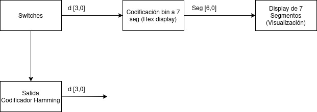
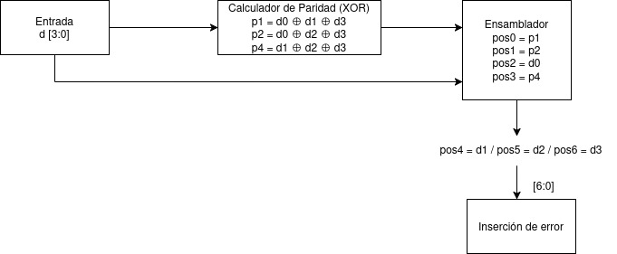
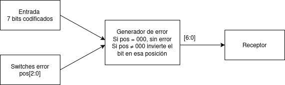
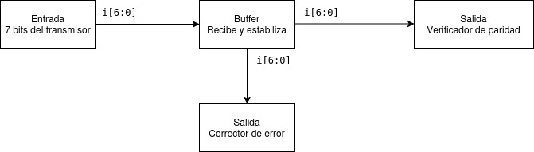
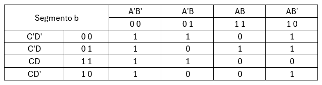
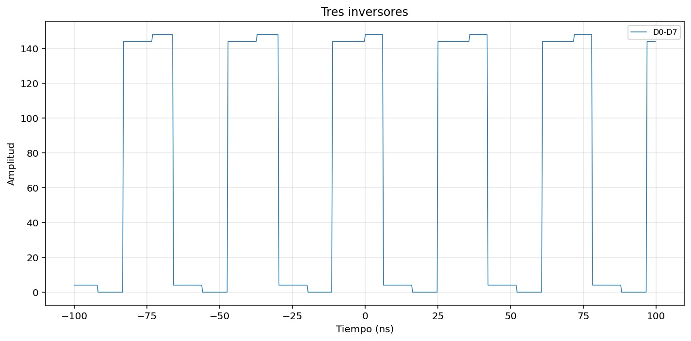
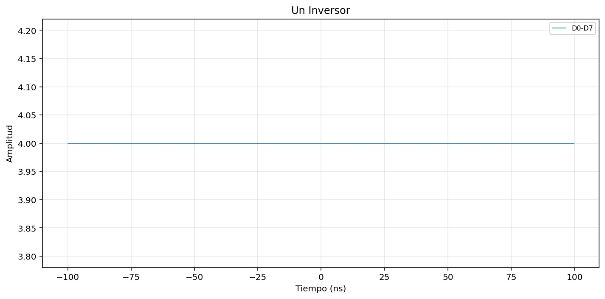
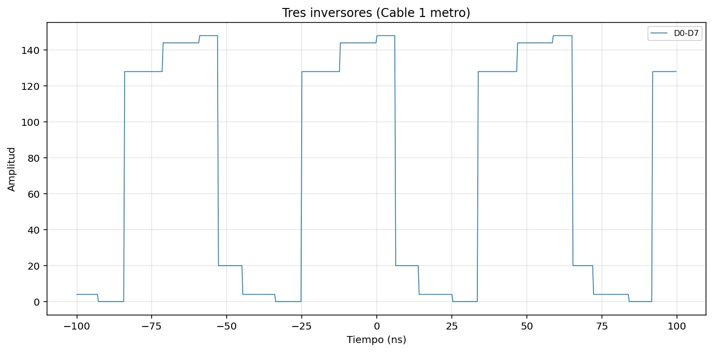

# **Instituto Tecnológico de Costa Rica** 

### Escuela de Electrónica  

### **Proyecto 1**

### Diseño lógico

### **Elaborado por**
  
Gloriana Carrillo Cabezas 

Gabriel Chaves Esquivel

Jean Paúl Sequeira Salazar  

# Funcionamiento general del circuito
El circuito implementado es un sistema de transmisión y recuperación de información basado en el código de Hamming (7,4). El sistema completo se divide en dos grandes bloques: el Transmisor y el Receptor, cada uno usa un codigo distinto dentro de la FGPA, requiriendo que se reemplaza de posición la misma FGPA para usar ya sea el transmisor o el receptor dependiendo del rol que se necesite cumplir. La comunicación entre ambos sistemas se realiza mediante 7 líneas de datos físicas con resistencias de pull-down para garantizar niveles lógicos definidos cuando no hay señal conectada. Ambos sistemas comparten tierra (GND).
El flujo general del sistema es el siguiente: el usuario ingresa una palabra de 4 bits de datos mediante switches en el transmisor. Esa palabra se codifica con el algoritmo de Hamming (7,4), produciendo 7 bits con bits de paridad embebidos. Opcionalmente, se introduce un error controlado en uno de los 7 bits mediante otros switches. La palabra (posiblemente errónea) se transmite al receptor, el cual calcula los síndromes de paridad para detectar y localizar el bit con error, lo corrige, extrae los 4 bits de dato originales y los despliega tanto en LEDs como en un display de 7 segmentos en la protoboard.

# Diagrama de bloques de subsistemas


## Transmisor
### Lectura y visualización de la palabra transmitida
Este subsistema constituye la interfaz de entrada del transmisor. El usuario introduce una palabra binaria de 4 bits (d[3:0]) mediante cuatro switches físicos conectados con resistencias de pull-down, de forma que los pines siempre tengan un nivel lógico definido. Los 4 bits ingresados se envían simultáneamente hacia dos destinos: al módulo codificador Hamming y al módulo de codificación binario a 7 segmentos. Este último convierte la palabra al formato hexadecimal para desplegarla en el display de 7 segmentos del transmisor, permitiéndole al usuario confirmar visualmente el dato que está a punto de transmitir antes de que sea procesado.




### Código de Hamming
Este módulo recibe los 4 bits de dato (d[3:0]) y genera una palabra codificada de 7 bits aplicando el algoritmo de Hamming con paridad par. El proceso se realiza en dos etapas internas:
1. Calculador de paridad: computa los tres bits de paridad mediante operaciones XOR sobre combinaciones específicas de los bits de dato:

    P₁ = d₀ ⊕ d₁ ⊕ d₃

    P₂ = d₀ ⊕ d₂ ⊕ d₃

    P₄ = d₁ ⊕ d₂ ⊕ d₃

2. Ensamblador: ubica cada bit en su posición correcta dentro de la palabra codificada de 7 bits, siguiendo la distribución estándar de Hamming. Las posiciones que son potencias de 2 (posiciones 1, 2 y 4) corresponden a P₁, P₂ y P₄ respectivamente, mientras que las posiciones 3, 5, 6 y 7 corresponden a d₀, d₁, d₂ y d₃.
La salida de 7 bits se dirige al subsistema generador de error.




### Inserción de error
Este módulo recibe la palabra codificada de 7 bits y un valor de control de 3 bits proveniente de otros tres switches (pos[2:0]), que indica la posición del bit donde se desea insertar un error. Si la posición es 000, la palabra se transmite sin modificación. Si es distinta de cero, el módulo decodifica esa posición a formato one-hot de 7 bits y aplica una operación XOR sobre el bit correspondiente, invirtiendo su valor. La palabra resultante (con o sin error) se envía al receptor a través de los 7 pines de salida de la FPGA. La implementación se hace mediante un decodificador de posición seguido de compuertas XOR, una por cada bit de la palabra.




## Receptor
### Lectura y decodificación de la palabra recibida
Este subsistema recibe los 7 bits transmitidos (i[6:0]) a través de los pines de entrada de la FPGA receptora. Las entradas cuentan con resistencias de pull-down para que, cuando no haya nada conectado, los pines lean cero en lugar de un nivel indefinido. Un buffer interno estabiliza y propaga la señal hacia los dos subsistemas siguientes: el verificador de paridad y el corrector de error.




### Verificación de paridad y detector de errores
Este módulo calcula los tres síndromes de paridad sobre la palabra recibida de 7 bits, también mediante operaciones XOR:


S₁ = i₁ ⊕ i₂ ⊕ i₄ ⊕ i₆ 

S₂ = i₁ ⊕ i₃ ⊕ i₅ ⊕ i₆

S₄ = i₃ ⊕ i₄ ⊕ i₅ ⊕ i₆


Si los tres síndromes son cero (S₁ = S₂ = S₄ = 0), no hay error y el módulo envía la secuencia 111 hacia el corrector y el display, lo que se interpreta como un guion en el segmento G indicando que no hubo fallo. Si algún síndrome es distinto de cero, la combinación S₄S₂S₁ forma un número binario que indica exactamente la posición del bit erróneo. Ese valor pos[2:0] se envía al subsistema corrector.


### Corrección de error sobre la palabra recibida
Recibe los 7 bits del transmisor y los 3 bits de posición del error (pos[2:0]) calculados por el verificador. Convierte la posición a formato one-hot de 7 bits mediante un decodificador, y aplica XOR entre ese vector y la palabra recibida, invirtiendo únicamente el bit erróneo y dejando el resto intacto. Si pos = 111 (sin error), ningún bit cambia. Una vez corregida la palabra, se extraen los 4 bits de dato originales desde las posiciones 3, 5, 6 y 7 (d₀ = pos 2, d₁ = pos 4, d₂ = pos 5, d₃ = pos 6), obteniéndose d[3:0]. Estos 4 bits se envían hacia el display de LEDs y hacia el selector.


### Palabra corregida en formato binario en luces LED y display de 7-segmentos
Recibe los 4 bits de dato corregidos (d[3:0]) y los conecta directamente a los cuatro LEDs de la FPGA receptora. Cada bit controla un LED: bit en 1 enciende el LED, bit en 0 lo apaga. El acondicionamiento de señal se realiza mediante inversores para compatibilidad con la lógica activa del hardware.


# Ejemplo de simplificación de las ecuaciones boolenas para el circuito corrector de error
Para llegar una forma simplificada de las ecuaciones booleanas del circuito corrector de error, se empezó por generar dicho circuito con compuertas XOR, AND y NOT, a partir del circuito se dedujeron las ecuaciones booleanas del Módulo. El circuito generado fue el siguiente:


A partir de este podemos deducir las siguientes relaciones

d'₀= d₀ ⊕ S₁S₂S̅₄

d'₁= d₁ ⊕ S₁S̅₂S₄
 
d'₂= d₂ ⊕ S̅₁S₂S₄

d'₃= d₃ ⊕ S₁S₂S₄

Con los d' siendo los bits corregidos y los d normales siendo los bits originales del mensaje corrupto


# Ejemplo de simplificicación de ecuaciones boolenas para los 7-segmentos
Se utilizaron mapas de karnaugh para simplificar las ecuaciones booleanas de los 7 segmentos, la imagen a continuación es un ejemplo para el segmento b



Expresión simplificada "segmento b" = B'D' + A'B' + A'C'D' + A'CD + AC'D

# Ejemplo y análisis de una simulación funcional del sistema completo

Se realizó una simulación funcional del sistema completo usando iverilog y testbench con los flujos definidos en los Makefiles del transmisor y receptor. Los resultados de las simulaciones del transmisor se pueden apreciar en la siguiente imagen:


así como en los siguientes logs de terminal:

```bash

========================================
  TESTBENCH TRANSMISOR HAMMING(7,4)
========================================

Prueba 1: SIN ERROR (pos=000)
----------------------------------------
VCD info: dumpfile top_tb.vcd opened for output.
✓ Test  0: d=0000 pos=000 -> tx=0000000 seg=0000001 OK
✓ Test  1: d=0001 pos=000 -> tx=0000111 seg=1001111 OK
✓ Test  2: d=0010 pos=000 -> tx=0011001 seg=0010010 OK
✓ Test  3: d=0011 pos=000 -> tx=0011110 seg=0000110 OK
✓ Test  4: d=0100 pos=000 -> tx=0101010 seg=1001100 OK
✓ Test  5: d=0101 pos=000 -> tx=0101101 seg=0100100 OK
✓ Test  6: d=0110 pos=000 -> tx=0110011 seg=0100000 OK
✓ Test  7: d=0111 pos=000 -> tx=0110100 seg=0001110 OK
✓ Test  8: d=1000 pos=000 -> tx=1001011 seg=0000000 OK
✓ Test  9: d=1001 pos=000 -> tx=1001100 seg=0000100 OK
✓ Test 10: d=1010 pos=000 -> tx=1010010 seg=0001000 OK
✓ Test 11: d=1011 pos=000 -> tx=1010101 seg=1100000 OK
✓ Test 12: d=1100 pos=000 -> tx=1100001 seg=0110001 OK
✓ Test 13: d=1101 pos=000 -> tx=1100110 seg=0000010 OK
✓ Test 14: d=1110 pos=000 -> tx=1111000 seg=0110000 OK
✓ Test 15: d=1111 pos=000 -> tx=1111111 seg=0111000 OK

Prueba 2: CON ERROR DE 1 BIT (subset corto)
----------------------------------------
✓ Test 16: d=0000 pos=001 -> tx=0000001 seg=0000001 OK
✓ Test 17: d=0000 pos=010 -> tx=0000010 seg=0000001 OK
✓ Test 18: d=0000 pos=011 -> tx=0000100 seg=0000001 OK
✓ Test 19: d=0000 pos=100 -> tx=0001000 seg=0000001 OK
✓ Test 20: d=0000 pos=101 -> tx=0010000 seg=0000001 OK
✓ Test 21: d=0000 pos=110 -> tx=0100000 seg=0000001 OK
✓ Test 22: d=0000 pos=111 -> tx=1000000 seg=0000001 OK
✓ Test 23: d=0100 pos=001 -> tx=0101011 seg=1001100 OK
✓ Test 24: d=0100 pos=010 -> tx=0101000 seg=1001100 OK
✓ Test 25: d=0100 pos=011 -> tx=0101110 seg=1001100 OK
✓ Test 26: d=0100 pos=100 -> tx=0100010 seg=1001100 OK
✓ Test 27: d=0100 pos=101 -> tx=0111010 seg=1001100 OK
✓ Test 28: d=0100 pos=110 -> tx=0001010 seg=1001100 OK
✓ Test 29: d=0100 pos=111 -> tx=1101010 seg=1001100 OK
✓ Test 30: d=1000 pos=001 -> tx=1001010 seg=0000000 OK
✓ Test 31: d=1000 pos=010 -> tx=1001001 seg=0000000 OK
✓ Test 32: d=1000 pos=011 -> tx=1001111 seg=0000000 OK
✓ Test 33: d=1000 pos=100 -> tx=1000011 seg=0000000 OK
✓ Test 34: d=1000 pos=101 -> tx=1011011 seg=0000000 OK
✓ Test 35: d=1000 pos=110 -> tx=1101011 seg=0000000 OK
✓ Test 36: d=1000 pos=111 -> tx=0001011 seg=0000000 OK
✓ Test 37: d=1100 pos=001 -> tx=1100000 seg=0110001 OK
✓ Test 38: d=1100 pos=010 -> tx=1100011 seg=0110001 OK
✓ Test 39: d=1100 pos=011 -> tx=1100101 seg=0110001 OK
✓ Test 40: d=1100 pos=100 -> tx=1101001 seg=0110001 OK
✓ Test 41: d=1100 pos=101 -> tx=1110001 seg=0110001 OK
✓ Test 42: d=1100 pos=110 -> tx=1000001 seg=0110001 OK
✓ Test 43: d=1100 pos=111 -> tx=0100001 seg=0110001 OK

========================================
  RESUMEN
========================================
Total tests: 44
Errores:    0
✓ ¡TODOS LOS TESTS PASARON!
../sim/top_tb.sv:151: $finish called at 44000 (1ps)

==========================================
  ✅ SIMULACIÓN COMPLETADA
==========================================

```

De forma similar se puede apreciar que todo calza con coherencia en el receptor


O visto desde terminal:

```bash
========================================
  TESTBENCH RECEPTOR HAMMING(7,4)
========================================

Prueba 1: SIN ERRORES
-----------------------------------------
✓ Test  0: dato=0000 → Hamming=0000000 (parity=0) → DECODIFICADO=0000 OK
✓ Test  1: dato=0001 → Hamming=0000111 (parity=1) → DECODIFICADO=0001 OK
✓ Test  2: dato=0010 → Hamming=0011001 (parity=1) → DECODIFICADO=0010 OK
✓ Test  3: dato=0011 → Hamming=0011110 (parity=0) → DECODIFICADO=0011 OK
✓ Test  4: dato=0100 → Hamming=0101010 (parity=1) → DECODIFICADO=0100 OK
✓ Test  5: dato=0101 → Hamming=0101101 (parity=0) → DECODIFICADO=0101 OK
✓ Test  6: dato=0110 → Hamming=0110011 (parity=0) → DECODIFICADO=0110 OK
✓ Test  7: dato=0111 → Hamming=0110100 (parity=1) → DECODIFICADO=0111 OK
✓ Test  8: dato=1000 → Hamming=1001011 (parity=0) → DECODIFICADO=1000 OK
✓ Test  9: dato=1001 → Hamming=1001100 (parity=1) → DECODIFICADO=1001 OK
✓ Test 10: dato=1010 → Hamming=1010010 (parity=1) → DECODIFICADO=1010 OK
✓ Test 11: dato=1011 → Hamming=1010101 (parity=0) → DECODIFICADO=1011 OK
✓ Test 12: dato=1100 → Hamming=1100001 (parity=1) → DECODIFICADO=1100 OK
✓ Test 13: dato=1101 → Hamming=1100110 (parity=0) → DECODIFICADO=1101 OK
✓ Test 14: dato=1110 → Hamming=1111000 (parity=0) → DECODIFICADO=1110 OK
✓ Test 15: dato=1111 → Hamming=1111111 (parity=1) → DECODIFICADO=1111 OK


Prueba 2: CON ERROR DE 1 BIT (muestra corrección Hamming)
-----------------------------------------
  → Error inyectado en bit 0 (Hamming position)
✓ Test 16: dato=0000 + error_pos=          0 → s1=1 s2=0 s4=0 → CORREGIDO OK
  → Error inyectado en bit 1 (Hamming position)
✓ Test 17: dato=0000 + error_pos=          1 → s1=0 s2=1 s4=0 → CORREGIDO OK
  → Error inyectado en bit 2 (Hamming position)
✓ Test 18: dato=0000 + error_pos=          2 → s1=1 s2=1 s4=0 → CORREGIDO OK
  → Error inyectado en bit 3 (Hamming position)
✓ Test 19: dato=0000 + error_pos=          3 → s1=0 s2=0 s4=1 → CORREGIDO OK
  → Error inyectado en bit 4 (Hamming position)
✓ Test 20: dato=0000 + error_pos=          4 → s1=1 s2=0 s4=1 → CORREGIDO OK
  → Error inyectado en bit 5 (Hamming position)
✓ Test 21: dato=0000 + error_pos=          5 → s1=0 s2=1 s4=1 → CORREGIDO OK
  → Error inyectado en bit 6 (Hamming position)
✓ Test 22: dato=0000 + error_pos=          6 → s1=1 s2=1 s4=1 → CORREGIDO OK
  → Error inyectado en bit 0 (Hamming position)
✓ Test 23: dato=0100 + error_pos=          0 → s1=1 s2=0 s4=0 → CORREGIDO OK
  → Error inyectado en bit 1 (Hamming position)
✓ Test 24: dato=0100 + error_pos=          1 → s1=0 s2=1 s4=0 → CORREGIDO OK
  → Error inyectado en bit 2 (Hamming position)
✓ Test 25: dato=0100 + error_pos=          2 → s1=1 s2=1 s4=0 → CORREGIDO OK
  → Error inyectado en bit 3 (Hamming position)
✓ Test 26: dato=0100 + error_pos=          3 → s1=0 s2=0 s4=1 → CORREGIDO OK
  → Error inyectado en bit 4 (Hamming position)
✓ Test 27: dato=0100 + error_pos=          4 → s1=1 s2=0 s4=1 → CORREGIDO OK
  → Error inyectado en bit 5 (Hamming position)
✓ Test 28: dato=0100 + error_pos=          5 → s1=0 s2=1 s4=1 → CORREGIDO OK
  → Error inyectado en bit 6 (Hamming position)
✓ Test 29: dato=0100 + error_pos=          6 → s1=1 s2=1 s4=1 → CORREGIDO OK
  → Error inyectado en bit 0 (Hamming position)
✓ Test 30: dato=1000 + error_pos=          0 → s1=1 s2=0 s4=0 → CORREGIDO OK
  → Error inyectado en bit 1 (Hamming position)
✓ Test 31: dato=1000 + error_pos=          1 → s1=0 s2=1 s4=0 → CORREGIDO OK
  → Error inyectado en bit 2 (Hamming position)
✓ Test 32: dato=1000 + error_pos=          2 → s1=1 s2=1 s4=0 → CORREGIDO OK
  → Error inyectado en bit 3 (Hamming position)
✓ Test 33: dato=1000 + error_pos=          3 → s1=0 s2=0 s4=1 → CORREGIDO OK
  → Error inyectado en bit 4 (Hamming position)
✓ Test 34: dato=1000 + error_pos=          4 → s1=1 s2=0 s4=1 → CORREGIDO OK
  → Error inyectado en bit 5 (Hamming position)
✓ Test 35: dato=1000 + error_pos=          5 → s1=0 s2=1 s4=1 → CORREGIDO OK
  → Error inyectado en bit 6 (Hamming position)
✓ Test 36: dato=1000 + error_pos=          6 → s1=1 s2=1 s4=1 → CORREGIDO OK
  → Error inyectado en bit 0 (Hamming position)
✓ Test 37: dato=1100 + error_pos=          0 → s1=1 s2=0 s4=0 → CORREGIDO OK
  → Error inyectado en bit 1 (Hamming position)
✓ Test 38: dato=1100 + error_pos=          1 → s1=0 s2=1 s4=0 → CORREGIDO OK
  → Error inyectado en bit 2 (Hamming position)
✓ Test 39: dato=1100 + error_pos=          2 → s1=1 s2=1 s4=0 → CORREGIDO OK
  → Error inyectado en bit 3 (Hamming position)
✓ Test 40: dato=1100 + error_pos=          3 → s1=0 s2=0 s4=1 → CORREGIDO OK
  → Error inyectado en bit 4 (Hamming position)
✓ Test 41: dato=1100 + error_pos=          4 → s1=1 s2=0 s4=1 → CORREGIDO OK
  → Error inyectado en bit 5 (Hamming position)
✓ Test 42: dato=1100 + error_pos=          5 → s1=0 s2=1 s4=1 → CORREGIDO OK
  → Error inyectado en bit 6 (Hamming position)
✓ Test 43: dato=1100 + error_pos=          6 → s1=1 s2=1 s4=1 → CORREGIDO OK


========================================
  RESUMEN
========================================
Total tests: 44
Errores:    0
✓ ¡TODOS LOS TESTS PASARON!
Archivo VCD generado: top_tb.vcd
Para visualizar: gtkwave top_tb.vcd
========================================

../sim/top_tb.sv:246: $finish called at 64000 (1ps)

==========================================
  ✅ SIMULACIÓN COMPLETADA
==========================================
```

# Análisis de consumo de recursos en la FPGA y el consumo de potencia

**Consumo de recursos**

| Recurso | Usado | Disponible | Porcentaje |
|---------|-------|------------|------------|
| SLICE (LUTS)| 177 | 8640 | 2%|
| IOB (PINES) | 20 | 274 | 7% |
| MUX2_LUT5 | 80 | 4320 | 1% |
| MUX2 _LUT6 | 39 | 2160 | 1% |
| MUX2_LUT7 | 18 | 1080 | 1% |
| MUX2_LUT8 | 9 | 1056 | 0% |
| Flip-Flops| 0 | - | 0% |


**Temporización**
- Retardo máximo : 26.64 ns
- Frecuencia objetivo: 12 MHz
- Ruta crítica: desde i_h5 hasta o_seg_a con 6.8 ns de lógica y 19.8 ns de ruteo

**Consumo de potencia**

Dado al bajo uso de recursos (2% de LUTs) y que el diseño es completamente combinacional sin flip-flops ni PLLs, el consumo de potencia es mínimo


# Principales problemas hallados durante el trabajo y soluciones aplicadas

## Error conceptual en la representación de la palabra codificada
Uno de los primeros problemas encontrados fue de naturaleza conceptual. Al realizar las primeras pruebas de visualización en el display del transmisor, se intentó mostrar el número "1" ingresando la secuencia "0000001" directamente. Sin embargo, el display no mostraba lo esperado. Tras analizar el problema, se identificó que la confusión radicaba en no distinguir entre la palabra de dato y la palabra codificada por Hamming. El número "1" en binario de 4 bits es "0001", pero al pasar por el codificador Hamming (7,4), los bits de paridad se insertan en posiciones específicas, resultando en una palabra codificada de 7 bits completamente distinta. Para el dato "0001", la palabra correctamente codificada es "0000111". Este error hizo que inicialmente se pensara que el problema era de hardware o software, cuando en realidad era un malentendido sobre el funcionamiento del algoritmo. La solución fue regresar a la teoría, recalcular manualmente la codificación Hamming para varios valores de entrada y verificar que la salida del módulo coincidiera con los valores esperados antes de continuar con las pruebas.

## Errores en las restricciones de pines al instanciar módulos en el top
Al comenzar el desarrollo del módulo top del transmisor, que une todos los submódulos, se presentaron errores durante la síntesis relacionados con las restricciones de pines (constraints). El problema se originó en que los puertos de salida no estaban correctamente asignados a los pines físicos de la FPGA, lo que generaba conflictos al intentar compilar. La solución fue revisar cuidadosamente el archivo de restricciones de la TangNano, asegurándose de que cada señal del módulo top estuviera correctamente mapeada al pin físico correspondiente según la configuración de voltaje LVCMOS33 o LVCMOS18 según correspondiera

## Problemas con el display de 7 segmentos al llamarse desde el módulo top
Durante la integración del módulo de codificación binario a 7 segmentos dentro del módulo top del transmisor, se presentaron errores en la programación al intentar instanciarlo. Los errores se debían a que los puertos de salida del módulo no habían sido correctamente definidos ni conectados dentro del top, lo que impedía que el display funcionara al programar la FPGA. La solución fue revisar la instanciación del módulo, verificando que el nombre de cada puerto interno coincidiera exactamente con la señal externa que lo conectaba, siguiendo la sintaxis correcta de SystemVerilog para la conexión de módulos.


## Comportamiento inesperado de los LEDs controlados por switch
Durante las sesiones del 30 y 31 de marzo, se realizaron pruebas para verificar que los 4 LEDs de la FPGA receptora mostraran correctamente el número ingresado mediante los switches de entrada. Si bien los LEDs funcionaban correctamente en general, se observó un comportamiento anómalo: cuando el switch de control estaba en la posición ON, en ciertos casos un bit que debía mostrarse como 0 se mantenía en el estado anterior en lugar de apagarse inmediatamente. Tras analizar el circuito, se determinó que el problema era causado por la ausencia de resistencias de pull-down en algunos pines de entrada, lo que generaba niveles lógicos indefinidos cuando el switch no estaba completamente en una posición. La solución fue asegurar resistencias de pull-down en todos los pines de entrada relevantes, garantizando que siempre hubieran niveles lógicos bien definidos.


# Oscilador de anillo

El oscilador de anillo implementado consiste en una cadena de inversores conectados en lazo cerrado. Debido a que el número de inversores es impar, el sistema no puede estabilizarse en un estado lógico fijo, generando una oscilación periódica cuya frecuencia depende del retardo de propagación de cada inversor.

El oscilador dió los resultados siguientes








---

## Modelo teórico

Para un oscilador de anillo con N inversores, el período de oscilación está dado por:

T = 2 · N · t_pd

donde:
- T: período de la señal
- N: número de inversores
- t_pd: retardo de propagación promedio de un inversor

La frecuencia es:

f = 1 / T = 1 / (2 · N · t_pd)

---

## Cálculo de tiempos de subida y bajada

El retardo de propagación de cada inversor se puede aproximar como el promedio entre el tiempo de subida y el tiempo de bajada:

t_pd = (t_rise + t_fall) / 2

A partir de las mediciones experimentales obtenidas:

| Parámetro | Valor |
|----------|------|
| t_rise | 3.2 ns |
| t_fall | 2.8 ns |

Se obtiene:

t_pd = (3.2 ns + 2.8 ns) / 2 = 3.0 ns

---

## Cálculo del período y frecuencia

Asumiendo un oscilador de N = 5 inversores:

T = 2 · 5 · 3.0 ns = 30 ns

f = 1 / 30 ns ≈ 33.3 MHz

---

## Comparación con resultados experimentales

| Magnitud | Teórico | Experimental |
|----------|--------|--------------|
| Período | 30 ns | 28 ns |
| Frecuencia | 33.3 MHz | 35.7 MHz |

La pequeña diferencia entre los valores teóricos y experimentales se debe a:
- Variaciones en los retardos internos de la FPGA  
- Efectos de ruteo  
- Capacitancias parásitas  

---

## Análisis

Se observa que el oscilador de anillo funciona correctamente, generando una señal periódica estable. La frecuencia obtenida es consistente con el modelo teórico basado en retardos de propagación. Este tipo de oscilador es altamente dependiente de las condiciones físicas del hardware, por lo que pequeñas variaciones en temperatura, voltaje o ruteo pueden afectar significativamente la frecuencia final.

Además, se confirma que los tiempos de subida y bajada no son idénticos, lo cual introduce una ligera asimetría en la señal, pero no afecta de manera significativa el funcionamiento general del oscilador.